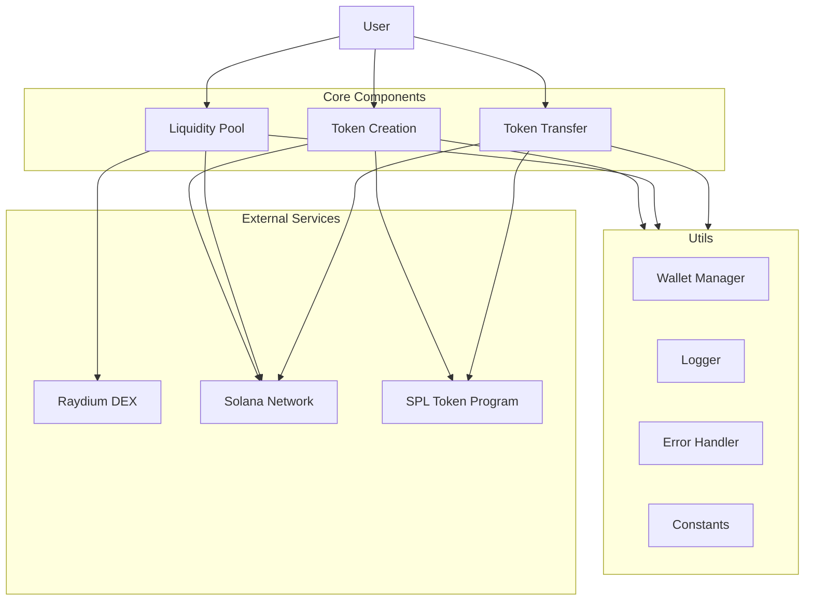
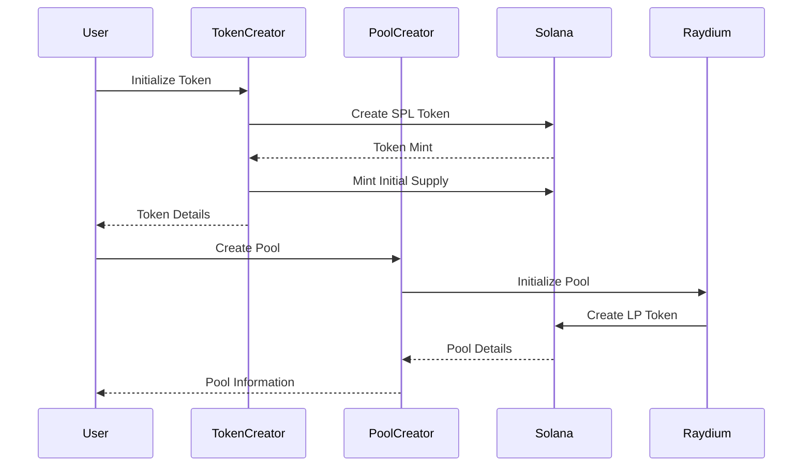

# Yogurt Token (YO) - Solana Meme Token Implementation

## Overview
Yogurt Token (YO) is a meme token implementation on Solana's devnet, leveraging SPL Token standard and Raydium DEX integration for liquidity provisioning.

## Architecture


## Token Specifications

### Basic Information
- Name: Yogurt Token
- Symbol: YO
- Decimals: 9 (defined in `src/utils/constants.ts`)
- Network: Solana Devnet

### Supply Details
- Total Initial Supply: 1,000 tokens (defined in TOKEN.INITIAL_MINT_AMOUNT)
- Maximum Supply: No hard cap implemented

### Token Addresses
- Token Mint: `Pa6sGCCedgGD1vxyEuhyRBeVFhjJchx5mSrSbaoPHWY`
- Base Token Account: `FRSH7DiYK5haGs87zCZ1HVeS8Ltib4hABgweYzaqqx1E`

### Implementation Details
- SPL Token Standard
- No freeze authority
- Single mint authority (creator wallet)
- Raydium pool pair with Wrapped SOL (WSOL)

### Pool Configuration
- Trading Fee: 0.3%
- Protocol Fee: 0.1%
- LP Fee: 0.2%
- Slippage Tolerance: 0.5%

## Why SPL Token?

### Technical Advantages
1. **Battle-tested Security**
   - Audited codebase
   - Protection against common vulnerabilities
   - Proven in production environments

2. **Standard Compliance & Ecosystem Integration**
   - Compatible with Solana wallets (Phantom, Solflare)
   - Integrated with DEXs (Raydium, Serum)
   - Supported by NFT marketplaces

3. **Cost-Efficiency**
   - No audit requirements
   - Minimal deployment costs
   - Reduced development time

4. **Future-Proof**
   - Automatic updates from Solana Labs
   - Ecosystem-wide improvements
   - Maintained standard

## Token Workflow


## Project Structure
```
src/
├── token/                 # Token operations
│   ├── token-creator.ts   # Token creation logic
│   └── transfer.ts        # Transfer operations
├── pool/                  # Liquidity pool
│   └── pool-creator.ts    # Pool creation & management
├── utils/                 # Shared utilities
│   ├── constants.ts       # Configuration constants
│   ├── error-handler.ts   # Error management
│   ├── logger.ts          # Logging system
│   └── wallet.ts         # Wallet operations
└── types/                # TypeScript definitions

tests/                    # Test suites
docs/                    # Documentation
```

## Key Features
- SPL Token creation
- Token transfers
- Raydium DEX integration
- Liquidity pool setup
- Initial supply distribution

## Important Notes
- Currently configured for Solana devnet
- Requires sufficient SOL for transactions
- Keep wallet keys secure
- Test thoroughly before mainnet deployment

## Error Handling
Common issues and solutions:
1. Insufficient SOL: Use `solana airdrop`
2. Transaction failures: Check devnet status and retry
3. SDK version conflicts: Use specified versions in package.json

## Security Considerations
- Secure key management
- Rate limiting for airdrops
- Transaction verification
- Access control implementation

## Getting Started

### Prerequisites
- Node.js >= 18
- TypeScript >= 4.x
- Solana Tool Suite

### Installation
```bash
# Clone repository
git clone https://github.com/dinesh3456/yogurt-token.git

# Install dependencies
npm install

# Setup development environment
npm run setup:dev

# Build project
npm run build
```

### Configuration
Create `.env` file:
```env
NETWORK=devnet
TOKEN_NAME=YOGURT
TOKEN_SYMBOL=YO
TOKEN_DECIMALS=9
INITIAL_SUPPLY=1000000000
```

### Usage
```typescript
import { TokenCreator, PoolCreator } from './src';

// Create token
const tokenCreator = new TokenCreator(wallet);
const token = await tokenCreator.createToken({
  decimals: 9,
  initialSupply: 1000000000
});

// Create liquidity pool
const poolCreator = new PoolCreator(wallet);
const pool = await poolCreator.createPool({
  tokenAMint: token.mint,
  tokenBMint: WRAPPED_SOL_MINT
});
```

## Testing
```bash
# Run all tests
npm test

# Run specific test suite
npm test token
```

## Development Tools
- TypeScript for type safety
- ESLint & Prettier for code quality
- Winston for logging

## Credits
Development assistance provided by:
- Anthropic's Claude AI (Architecture, code review, documentation)
- Raydium SDK documentation
- Solana Program Library (SPL) documentation